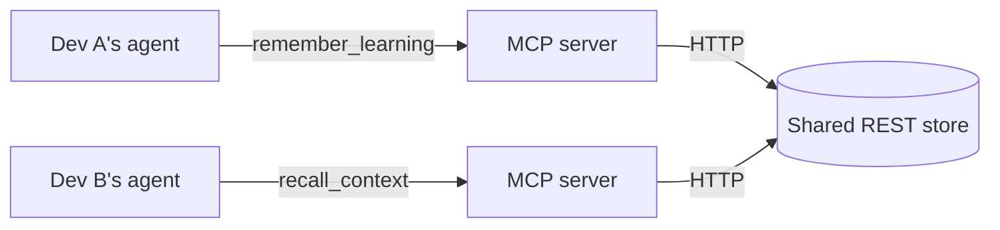

# shared-agent-context

**Share AI/agent context between collaborators so teammates' agents stop
rediscovering the same things.**

When one developer's agent learns something non-obvious about a project (a build
quirk, an architectural decision, a "don't touch X" gotcha), it captures that
learning to a shared store. A teammate starting a related task can have their
agent **recall** it instantly — no re-explaining, no rediscovery.

> Hackathon starter. The moat isn't storage — it's **relevance**: surfacing the
> right shared context at the right moment. See `packages/server/src/ranking.ts`.

## How it works



- **`packages/mcp`** — a Model Context Protocol (MCP) server that any MCP client
  (VS Code Copilot, Claude, Cursor) connects to over stdio. It exposes five tools:
  | Tool | Purpose |
  | --- | --- |
  | `remember_learning` | Capture a learning to the shared store (secrets auto-redacted) |
  | `recall_context` | Retrieve the most relevant learnings for the current task |
  | `list_recent_learnings` | Browse what the team has captured recently |
  | `vote_learning` | Up/down-vote to keep shared context curated and trustworthy |
  | `forget_learning` | Delete a stale or incorrect learning |
- **`packages/server`** — a small Express REST API that stores learnings and
  ranks search results by relevance (keyword overlap + tags + recency + votes).

A **learning** is scoped to a `projectId` — the shared namespace teammates agree
on. Everyone using the same `CONTEXT_PROJECT_ID` shares a context pool.

## Quickstart

```bash
npm install
npm run build

# 1. Start the shared backend (keep this running)
npm run start:server      # http://localhost:4000

# 2. The MCP server is launched automatically by your MCP client via
#    .vscode/mcp.json. To run it standalone for testing:
npm run start:mcp
```

In VS Code, open the Chat view, switch to **Agent** mode, and the
`shared-agent-context` server from `.vscode/mcp.json` will provide the tools.
(Re-run `npm run build` after changing MCP server code, since the client launches
the compiled `dist/`.)

## Demo script (the "wow")

1. **Dev A** hits a non-obvious quirk and tells their agent:
   *"Remember that our build fails on Node 18 — it needs Node 20+ for the crypto
   API we use."* → agent calls `remember_learning`.
2. **Dev B** (same `projectId`) starts a related task: *"Why might the build be
   failing for me?"* → agent calls `recall_context("build failing")` and already
   knows the Node-version gotcha — without Dev A explaining it.
3. Dev B's agent calls `vote_learning(helpful: true)`, so it ranks higher for the
   next teammate.

## Configuration

Copy `.env.example` and adjust. Key variables (set per MCP client in
`.vscode/mcp.json` → `env`):

| Variable | Default | Meaning |
| --- | --- | --- |
| `PORT` | `4000` | Port for the REST backend |
| `SAC_DATA_FILE` | `./data/learnings.json` | Where learnings persist |
| `CONTEXT_SERVER_URL` | `http://localhost:4000` | How the MCP server reaches the backend |
| `CONTEXT_PROJECT_ID` | `default` | Shared team namespace (use the same value across teammates) |
| `CONTEXT_AUTHOR` | OS username | Attribution for captured learnings |

## Security notes

- Agent context often contains secrets. The MCP server **redacts** common
  credential patterns (`packages/mcp/src/redact.ts`) before sending anything to
  the shared store. It deliberately over-redacts.
- The demo backend has no auth and stores plaintext JSON locally — fine for a
  hackathon, **not** for real shared infrastructure. See "Extending" below.

## Extending (where to take it next)

- **Better retrieval:** replace the heuristic in `ranking.ts` with embeddings /
  vector search — this is the real differentiator.
- **Real backend:** swap the JSON store for SQLite/Postgres; add auth + per-team
  isolation; deploy so collaborators actually share one store.
- **Auto-capture:** prompt the agent to call `remember_learning` automatically at
  the end of a task instead of relying on the user to ask.

## Project layout

```
packages/
  server/   REST backend + relevance ranking + JSON store
  mcp/      MCP stdio server (tools) + secret redaction + HTTP client
.vscode/mcp.json          registers the MCP server for VS Code
.github/copilot-instructions.md   project conventions for agents
```
