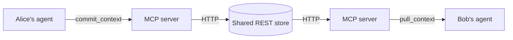

# shared-agent-context

**Share AI/agent context between collaborators so teammates' agents stop
rediscovering the same things.**

When a developer makes a breakthrough or wraps up for the day, their agent
**commits** a snapshot of their working context — what they did, where they left
off, and what's next. Teammates' agents **pull** those snapshots at the start of
their own sessions, so they begin already caught up instead of asking around.

> Like `git`, but for the *context* around the code. The shared project and your
> identity are auto-derived from the git repo, so teammates on the same repo
> share a context pool with zero setup.

## How it works



- **`packages/mcp`** — a Model Context Protocol (MCP) server that any MCP client
  (VS Code Copilot, Claude, Cursor) connects to over stdio. It exposes five tools:
  | Tool | When the agent uses it |
  | --- | --- |
  | `pull_context` | At the **start of a session** — catch up on teammates' commits since your last pull |
  | `commit_context` | On a **breakthrough or end of day** — share a session snapshot (secrets auto-redacted) |
  | `context_log` | Browse the recent timeline, like `git log` |
  | `vote_commit` | Up/down-vote to keep the timeline curated |
  | `forget_commit` | Delete a stale or incorrect commit |
- **`packages/server`** — a small Express REST API that stores commits and serves
  `pull` as a per-person feed (commits from *other* teammates since you last pulled).

A **context commit** is scoped to a `projectId` — normally the normalized git
remote (e.g. `github.com/acme/widget`), so everyone on the repo shares one pool
automatically.

## Quickstart

```bash
npm install
npm run build

# 1. Start the shared backend (keep this running)
npm run start:server      # http://localhost:4000

# 2. The MCP server is launched automatically by your MCP client via
#    .vscode/mcp.json. To run it standalone for testing:
npm run start:mcp
```

In VS Code, open the Chat view, switch to **Agent** mode, and the
`shared-agent-context` server from `.vscode/mcp.json` will provide the tools.
(Re-run `npm run build` after changing MCP server code, since the client launches
the compiled `dist/`.)

## Demo script (the "wow")

1. **Alice** finishes for the day. Her agent calls `commit_context` with a
   snapshot it assembled from the session — summary *"wired up auth middleware"*,
   where she left off, and next steps (*"token refresh still TODO"*).
2. **Bob** starts the next morning. His agent calls `pull_context` and immediately
   sees Alice's snapshot — what changed, where she stopped, what's next — with no
   standup and no Slack archaeology.
3. Bob's agent calls `vote_commit(helpful: true)`, then commits his own context at
   the end of his session. The loop continues.

## Configuration

Copy `.env.example` and adjust. Key variables (set per MCP client in
`.vscode/mcp.json` → `env`):

| Variable | Default | Meaning |
| --- | --- | --- |
| `PORT` | `4000` | Port for the REST backend |
| `SAC_DATA_FILE` | `./data/commits.json` | Where context commits persist |
| `CONTEXT_SERVER_URL` | `http://localhost:4000` | How the MCP server reaches the backend |
| `CONTEXT_PROJECT_DIR` | process cwd | Repo to derive the shared id + identity from (set to the workspace in `mcp.json`) |
| `CONTEXT_PROJECT_ID` | git remote | Override the shared namespace (normally auto-derived) |
| `CONTEXT_AUTHOR` | git user.name | Override attribution (normally auto-derived) |

## Security notes

- Agent context often contains secrets. The MCP server **redacts** common
  credential patterns (`packages/mcp/src/redact.ts`) before sending anything to
  the shared store. It deliberately over-redacts.
- The demo backend has no auth and stores plaintext JSON locally — fine for a
  hackathon, **not** for real shared infrastructure. See "Extending" below.

## Extending (where to take it next)

- **Real backend:** swap the JSON store for SQLite/Postgres; add auth + per-team
  isolation; deploy so collaborators on different machines actually share one store.
- **Relevance-filtered pull:** let `pull_context` take what you're about to work
  on and rank teammates' commits by relevance, not just recency.
- **Richer auto-capture:** have the agent assemble commits from the full session
  (files changed, decisions made) with even less prompting.

## Project layout

```
packages/
  server/   REST backend: context-commit store + per-person pull feed (JSON)
  mcp/      MCP stdio server (tools) + git scoping + secret redaction + HTTP client
.vscode/mcp.json          registers the MCP server for VS Code
.github/copilot-instructions.md   conventions + agent usage protocol
```
